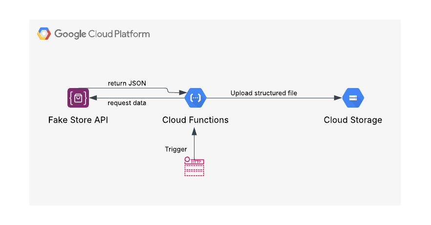

# gcp-analytics

**Additional files** :

The **Documentation_files** folder contains two PDF files:

* The first one, related to Task 1, presents the architecture diagram of the solution I designed and outlines the main steps followed to complete the process.
* The second one summarizes the results of the business questions addressed in Task 2.

The **Google-Analytics-task-2-and-3** folder includes the SQL queries I used in Tasks 2 and 3.

